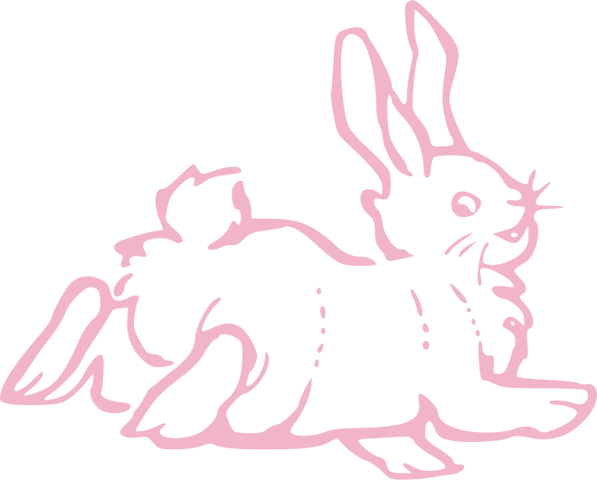
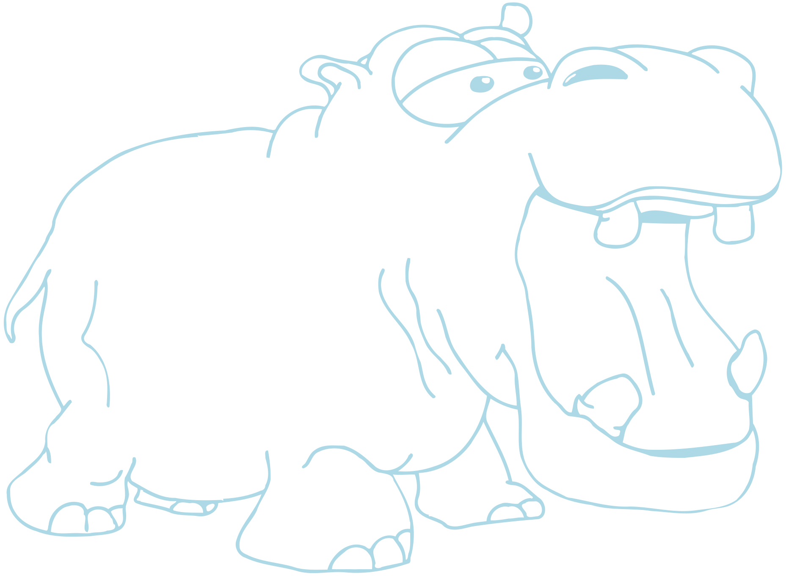

Project groups will be formed during the first week of the semester.

# Section 01 (13h30 > 14h45)

**Group 1**

  <figure class="group-figure">
    
    <figcaption class="group-caption"><b>Will</b></figcaption>
  </figure>
  <figure class="group-figure">
    
    <figcaption class="group-caption"><b>Brian</b></figcaption>
  </figure>

**Group 2**:

  <figure class="group-figure">
    
    <figcaption class="group-caption"><b>Ahsan</b></figcaption>
  </figure>
  <figure class="group-figure">
    
    <figcaption class="group-caption"><b>Kart</b></figcaption>
  </figure>

**Group 3**:

  <figure class="group-figure">
    
    <figcaption class="group-caption"><b>Noah</b></figcaption>
  </figure>
  <figure class="group-figure">
    
    <figcaption class="group-caption"><b>Jimmy</b></figcaption>
  </figure>

**Group 4**:

  <figure class="group-figure">
    
    <figcaption class="group-caption"><b>AC</b></figcaption>
  </figure>
  <figure class="group-figure">
    
    <figcaption class="group-caption"><b>Alex S.</b></figcaption>
  </figure>

**Group 5**:

  <figure class="group-figure">
    
    <figcaption class="group-caption"><b>Jenny</b></figcaption>
  </figure>
  <figure class="group-figure">
    
    <figcaption class="group-caption"><b>Hannah</b></figcaption>
  </figure>

**Group 6**:

  <figure class="group-figure">
    
    <figcaption class="group-caption"><b>Eli</b></figcaption>
  </figure>
  <figure class="group-figure">
    
    <figcaption class="group-caption"><b>Zohaib</b></figcaption>
  </figure>

**Group 7**:

  <figure class="group-figure">
    
    <figcaption class="group-caption"><b>Mack</b></figcaption>
  </figure>
  <figure class="group-figure">
    
    <figcaption class="group-caption"><b>Evan</b></figcaption>
  </figure>
  <figure class="group-figure">
    
    <figcaption class="group-caption"><b>Matthew</b></figcaption>
  </figure>

**Group 8**:

  <figure class="group-figure">
    
    <figcaption class="group-caption"><b>Young</b></figcaption>
  </figure>
  <figure class="group-figure">
    
    <figcaption class="group-caption"><b>Lisa</b></figcaption>
  </figure>

# Section 02 (15h00 > 16h15)

**Group 1**

  <figure class="group-figure">
    
    <figcaption class="group-caption"><b>Josh</b></figcaption>
  </figure>
  <figure class="group-figure">
    
    <figcaption class="group-caption"><b>Kathryn</b></figcaption>
  </figure>

**Group 2**:

  <figure class="group-figure">
    
    <figcaption class="group-caption"><b>Fernanda</b></figcaption>
  </figure>
  <figure class="group-figure">
    
    <figcaption class="group-caption"><b>Alex C</b></figcaption>
  </figure>

**Group 3**:

  <figure class="group-figure">
    
    <figcaption class="group-caption"><b>Maggie</b></figcaption>
  </figure>
  <figure class="group-figure">
    
    <figcaption class="group-caption"><b>Linh</b></figcaption>
  </figure>

**Group 4**:

  <figure class="group-figure">
    
    <figcaption class="group-caption"><b>Daniel</b></figcaption>
  </figure>
  <figure class="group-figure">
    
    <figcaption class="group-caption"><b>Andrew</b></figcaption>
  </figure>

**Group 5**:

  <figure class="group-figure">
    
    <figcaption class="group-caption"><b>Ruishi</b></figcaption>
  </figure>
  <figure class="group-figure">
    
    <figcaption class="group-caption"><b>Ruiyi</b></figcaption>
  </figure>

**Group 6**:

  <figure class="group-figure">
    
    <figcaption class="group-caption"><b>Cheryl</b></figcaption>
  </figure>

**Group 7**:

  <figure class="group-figure">
    
    <figcaption class="group-caption"><b>Connor</b></figcaption>
  </figure>
  <figure class="group-figure">
    
    <figcaption class="group-caption"><b>Miles</b></figcaption>
  </figure>

**Group 8**:

  <figure class="group-figure">
    
    <figcaption class="group-caption"><b>Kamene</b></figcaption>
  </figure>
  <figure class="group-figure">
    
    <figcaption class="group-caption"><b>Mia</b></figcaption>
  </figure>

